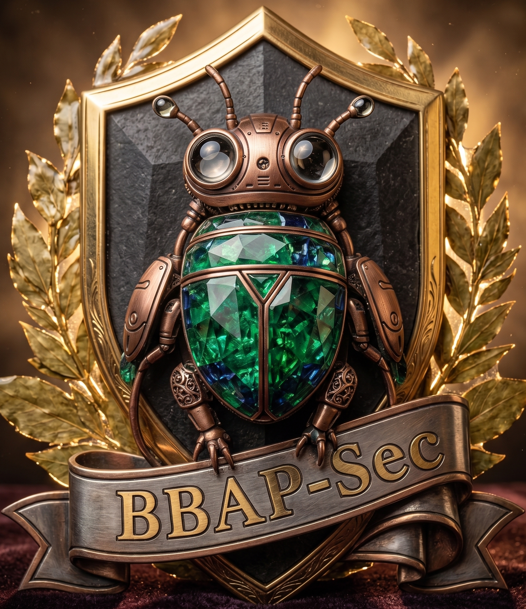

<p align="center">
  
</p>

<h1 align="center">BBAP-Sec AI Attack Lab</h1>

<p align="center">
  <strong>Educational AI Security Testing Pipeline</strong><br/>
  <em>Sponsored &amp; Produced by <a href="#">BBAP-Sec</a></em>
</p>

<p align="center">
  
  
  
  
</p>

---

## ⚠️ Disclaimer

> **This project is strictly for educational and authorized security testing purposes.**
> All attack simulations use public datasets and controlled environments.
> Do NOT use these techniques against production systems without explicit written authorization.
> BBAP-Sec and contributors are not responsible for any misuse of these tools.

---

## 📋 Overview

**BBAP-Sec AI Attack Lab** is a comprehensive, hands-on pipeline for learning and testing the security of AI/ML systems. It covers the five critical attack surfaces in modern AI:

| # | Attack Category | Technique | Module |
|---|----------------|-----------|--------|
| 1 | **Adversarial Attacks** | FGSM, PGD | `src/attacks/adversarial.py` |
| 2 | **Data Poisoning** | Label-flip, backdoor injection | `src/attacks/data_poisoning.py` |
| 3 | **Evasion Attacks** | Inference-time input manipulation | `src/attacks/evasion.py` |
| 4 | **Model Extraction** | API query-based model stealing | `src/attacks/model_extraction.py` |
| 5 | **Prompt Injection** | Direct / indirect LLM attacks | `src/attacks/prompt_injection.py` |

Each module includes **attack implementation**, **defense countermeasures**, and a **checklist** for structured assessment.

---

## 🏗️ Architecture

```
bbap-sec-ai-attack-lab/
├── README.md                    # You are here
├── .gitignore
├── Dockerfile                   # Container build
├── docker-compose.yml           # One-command deployment
├── requirements.txt             # Python dependencies
├── config/
│   └── config.yaml              # Global configuration
├── assets/
│   └── logo.png                 # BBAP-Sec branding
├── checklists/                  # Assessment checklists per attack
│   ├── 01_adversarial_attacks.md
│   ├── 02_data_poisoning.md
│   ├── 03_evasion_attacks.md
│   ├── 04_model_extraction.md
│   └── 05_prompt_injection.md
├── datasets/
│   └── download_datasets.py     # Public dataset downloader
├── src/
│   ├── attacks/                 # Attack implementations
│   │   ├── adversarial.py       # FGSM & PGD
│   │   ├── data_poisoning.py    # Training-time attacks
│   │   ├── evasion.py           # Inference-time evasion
│   │   ├── model_extraction.py  # Model stealing via API
│   │   └── prompt_injection.py  # LLM prompt attacks
│   ├── models/
│   │   └── target_model.py      # Target CNN & classifier
│   ├── defenses/
│   │   └── robustness.py        # Adversarial training & input sanitization
│   └── utils/
│       └── metrics.py           # ASR, accuracy, fidelity metrics
├── webapp/
│   ├── app.py                   # Flask web dashboard
│   ├── templates/
│   │   └── index.html           # Dashboard UI
│   └── static/
│       └── style.css            # BBAP-Sec themed styles
├── notebooks/
│   └── attack_walkthrough.ipynb # Interactive Jupyter tutorial
└── tests/
    └── test_attacks.py          # Unit tests
```

---

## 🚀 Quick Start

### Option A — Docker (Recommended)

```bash
git clone https://github.com/bbap-sec/ai-attack-lab.git
cd ai-attack-lab
docker-compose up --build
```

Open the dashboard at `http://localhost:5000`

### Option B — Local Install

```bash
# Clone and enter
git clone https://github.com/bbap-sec/ai-attack-lab.git
cd ai-attack-lab


# Create virtual environment
## with conda
conda create -n bbap-sec python=3.10 -y
conda activate bbap-sec

## with python
python3 -m venv venv
source venv/bin/activate      # Linux/Mac
# venv\Scripts\activate       # Windows

# Install dependencies
pip install -r requirements.txt

# Download public datasets
python datasets/download_datasets.py

# Run the web dashboard
python webapp/app.py
```

### Option C — CLI Mode

```bash
# Run individual attack modules directly
python -m src.attacks.adversarial --attack fgsm --epsilon 0.03
python -m src.attacks.adversarial --attack pgd --epsilon 0.03 --steps 40
python -m src.attacks.data_poisoning --poison-rate 0.1 --strategy label-flip
python -m src.attacks.evasion --target invoice_classifier
python -m src.attacks.model_extraction --queries 1000 --victim-url http://localhost:8080/predict
python -m src.attacks.prompt_injection --test-suite all
```

---

## 📦 Public Datasets Used

| Dataset | Purpose | Source |
|---------|---------|--------|
| MNIST | Adversarial robustness testing | `torchvision.datasets` |
| CIFAR-10 | Image classifier evasion | `torchvision.datasets` |
| SMS Spam Collection | Text evasion / poisoning | UCI ML Repository |
| AG News | Prompt injection context | `torchtext` / HuggingFace |
| Enron Email | Evasion & phishing detection | Public domain |

---

## 🔬 Attack Modules — Deep Dive

### 1. Adversarial Attacks (`src/attacks/adversarial.py`)

**FGSM** (Fast Gradient Sign Method) — Single-step perturbation:
```
x_adv = x + ε · sign(∇ₓ L(θ, x, y))
```

**PGD** (Projected Gradient Descent) — Iterative, stronger attack:
```
x⁰ = x + uniform(-ε, ε)
xᵗ⁺¹ = Π_{B(x,ε)}( xᵗ + α · sign(∇ₓ L(θ, xᵗ, y)) )
```

**Key parameters:** `epsilon` (perturbation budget), `alpha` (step size), `num_steps` (PGD iterations).

### 2. Data Poisoning (`src/attacks/data_poisoning.py`)

- **Label-flip attack:** Flip labels of a % of training samples to degrade accuracy.
- **Backdoor injection:** Embed a trigger pattern (e.g., pixel patch) so model learns a hidden mapping.
- **Clean-label attack:** Poison without changing labels — adversarial perturbation makes model learn wrong features.

### 3. Evasion Attacks (`src/attacks/evasion.py`)

Modify inputs at inference time to bypass detection:
- Feature manipulation on tabular data (e.g., invoice amount changes)
- Pixel perturbation on image classifiers
- Character-level text perturbation for NLP models

### 4. Model Extraction (`src/attacks/model_extraction.py`)

Query a black-box API to approximate the model:
- Random query strategy
- Active learning-based query strategy
- Fidelity measurement (agreement rate with victim)
- Knockoff Nets approach

### 5. Prompt Injection (`src/attacks/prompt_injection.py`)

Test LLM systems against:
- **Direct injection:** Override system prompts
- **Indirect injection:** Hidden instructions in retrieved documents
- **Instruction hierarchy violations:** Attempt privilege escalation
- **Data exfiltration probes:** Trick model into revealing context

---

## 🛡️ Defense Modules (`src/defenses/`)

Each attack module has corresponding defenses:

| Attack | Defense | Module |
|--------|---------|--------|
| FGSM/PGD | Adversarial training, input preprocessing | `robustness.py` |
| Data poisoning | Statistical outlier detection, spectral signatures | `robustness.py` |
| Evasion | Feature squeezing, ensemble detection | `robustness.py` |
| Model extraction | Query rate limiting, watermarking | `robustness.py` |
| Prompt injection | Input/output filtering, instruction hierarchy | `robustness.py` |

---

## ✅ Checklists

Each attack category has a structured assessment checklist in `checklists/`. Use these for systematic evaluation:

```
checklists/
├── 01_adversarial_attacks.md    # FGSM/PGD testing checklist
├── 02_data_poisoning.md         # Poisoning assessment
├── 03_evasion_attacks.md        # Evasion testing
├── 04_model_extraction.md       # API security checklist
└── 05_prompt_injection.md       # LLM security checklist
```

Each checklist follows the format:
- ☐ **Pre-test setup** — Environment and model preparation
- ☐ **Attack execution** — Step-by-step attack procedure
- ☐ **Measurement** — Metrics to record
- ☐ **Defense validation** — Verify countermeasures
- ☐ **Reporting** — Document findings

---

## 🌐 Web Dashboard

The web dashboard provides a visual interface for running attacks and viewing results.

**Features:**
- Run all 5 attack categories from the browser
- Real-time progress and result visualization
- Side-by-side comparison of original vs adversarial outputs
- Export results as JSON reports
- BBAP-Sec branded dark UI

**Access:** `http://localhost:5000` after starting with Docker or `python webapp/app.py`

---

## 🐳 Docker

```bash
# Build and run
docker-compose up --build

# Run in background
docker-compose up -d --build

# Stop
docker-compose down

# Run specific attack via Docker
docker-compose exec lab python -m src.attacks.adversarial --attack fgsm
```

---

## 📊 Metrics & Reporting

| Metric | Description | Used In |
|--------|-------------|---------|
| **ASR** (Attack Success Rate) | % of successful adversarial examples | All attacks |
| **Accuracy Drop** | Clean accuracy − adversarial accuracy | Adversarial, Evasion |
| **Fidelity** | Agreement between extracted and victim model | Model Extraction |
| **Perturbation Budget (ε)** | L∞ norm of perturbation | FGSM, PGD |
| **Poison Rate** | % of training data poisoned | Data Poisoning |
| **Bypass Rate** | % of injections that override system prompt | Prompt Injection |

---

## 🗺️ Alignment with Frameworks

This lab maps to industry-standard AI security frameworks:

| Framework | Coverage |
|-----------|----------|
| **MITRE ATLAS** | Tactics: ML Model Access, Evasion, Exfiltration, Persistence |
| **OWASP Top 10 for LLM (2025)** | LLM01 Prompt Injection, LLM02 Sensitive Info Disclosure |
| **OWASP Top 10 for Agentic Apps** | Tool misuse, memory poisoning |
| **NIST AI RMF** | Map, Measure, Manage functions |
| **MIT AI Risk Repository** | Domains: Privacy & Security, Malicious Actors & Misuse, AI System Safety |

---

## 🤝 Contributing

1. Fork the repository
2. Create a feature branch: `git checkout -b feature/new-attack`
3. Commit changes: `git commit -m "Add new attack module"`
4. Push: `git push origin feature/new-attack`
5. Open a Pull Request

---

## 📚 References

- Goodfellow et al., "Explaining and Harnessing Adversarial Examples" (FGSM)
- Madry et al., "Towards Deep Learning Models Resistant to Adversarial Attacks" (PGD)
- MITRE ATLAS Framework
- OWASP Top 10 for LLM Applications 2025
- MIT AI Risk Repository & Navigator
- Wang et al., "Jailbreaking Frontier Foundation Models Through Intention Deception" (2026)
---

<p align="center">
  <br/>
  <strong>BBAP-Sec</strong> — Building Better AI Protection<br/>
  <em>Educational AI Security Research</em>
</p>
